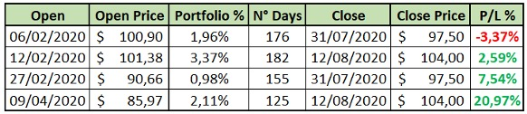
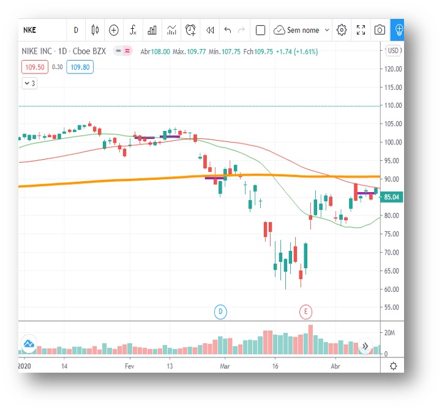
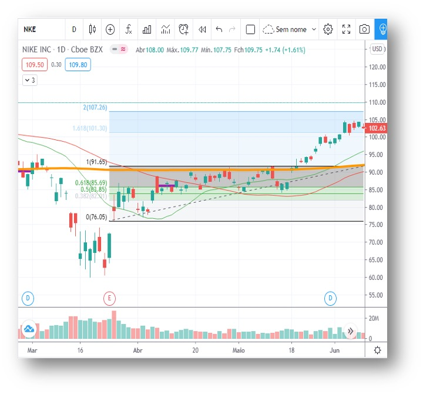
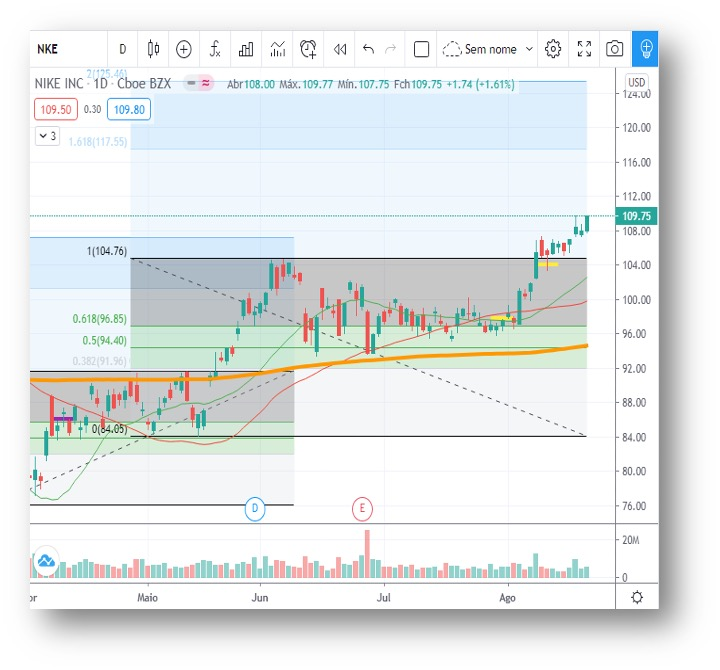

 
 

## Cenário

Operação aberta antes da crise provocada pelas impacto do COVID-19, primeira entrada foi considerando uma continuação de tendência de alta.seguida por uma segunda entrada(ainda antes da crise) para aumentar o percentual do ativo no portfólio, considerando a força da tendência de alta (Figura 1). 
Contudo houve a forte queda no início de Março, onde realizamos uma nova entrada na MA200( média móvel de 200 candles) em um forte suporte/resistência.
Após a constatação da crise (meados de Março), aguardamos a reação do S&P para realizar novas entradas, concluindo assim uma quarta compra já em Abril. 
Após um longo período, realizamos uma saída parcial para reduzir o percentual do ativo no portfolio e seguir com trailing stop na posições mantidas, porém acabamos por sair da operação de forme precoce (Figura 3). Portanto à resposta a pergunta é: “Analisando a operação com os graficos abaixo, concluímos que o resultado poderia ter sido melhor.”

## Vamos aos fatos.

Por quê, saímos da operação de forma precoce com o trailing stop?

Não Respeitamos os nossos *princípios da operação*, são esses:
* Lotes em tamanho proporcional;
* Distância proporcional entre reentradas;
* Trailing Stop após alvos alcançados;
* Atualizar o trailing Stop apenas após a confirmação do movimento projetado.

Após a “aparente” retomada do S&P em início de Maio, a primeira projeção de Fibonacci mostrava o primeiro alvo em 101,30, onde fechávamos toda a posição ou ajustávamos o trailing stop considerando o alvo atingido (veja: *princípios de operação*). Como não tomamos a decisão a tempo, perdemos a oportunidade de encerrar a operação 2 meses antes.

Iniciando nova análise, pós a saída não confirmada, foi traçado novo Fibonacci e identificado novo alvo. A partir deste momento devemos considerar o aspecto psicológico desta operação, o tamanho do Lote já tem um percentual do portfólio acima da média de outros ativos, estamos com a operação aberta por um longo período (a essa altura já cruzados os 90 dias). A inquietude e ansiedade aumentam à aversão ao risco proporcionalmente a tendência de erro por parte do investidor. Em outras palavras ficamos nos perguntando todos os "...e se tivéssemos saídos antes, ou não tivéssemos perdido a entrada 1 ou 2."

Aqui começamos as operações para reduzir o tamanho do ativo na carteira. Após um teste de topo não confirmado sobre as médias, reduzimos o tamanho do lote anulando as operações (de forma precipitada) e finalmente; após quase 6 meses; estando positivos na operação, buscamos o alvo traçado pela segunda vez. Confirmando rompimento do topo anterior, tomamos mais uma decisão precipitada. Encurtamos o trailing Stop, contudo o fizemos antes da confirmação do movimento (veja: *princípios de operação*). Garantimos um pequeno lucro e só. 

Passamos a maior parte do tempo exposto ao risco navegando a recuperação prevista do ativo. No momento que o ativo retoma sua tendência de alta o desgaste e a frustração causados pelas decisões precipitadas anteriores influenciam a consistência e respeito a estratégia. É quando a Heurística da Disponibilidade muito útil para tomadas de decisões no nosso cotidiano nos atrapalha. Pois cria um viés cognitivo onde a carga emocional influencia em novas análises. 

Fica a lição neste cenário, respeite sua estratégia, e análise e fique atento as armadilhas do emocional em seus Investimentos. Espero que o caso acima ajude nas próximas operações. Continue Investindo!