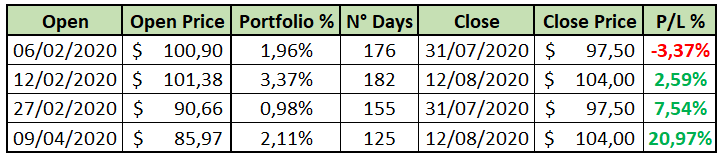
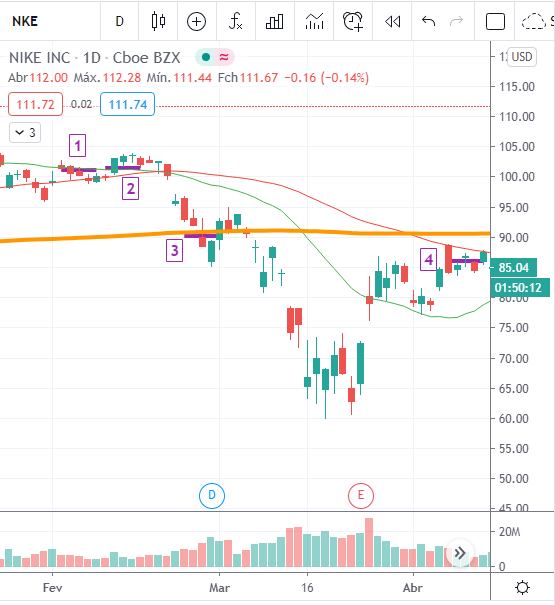
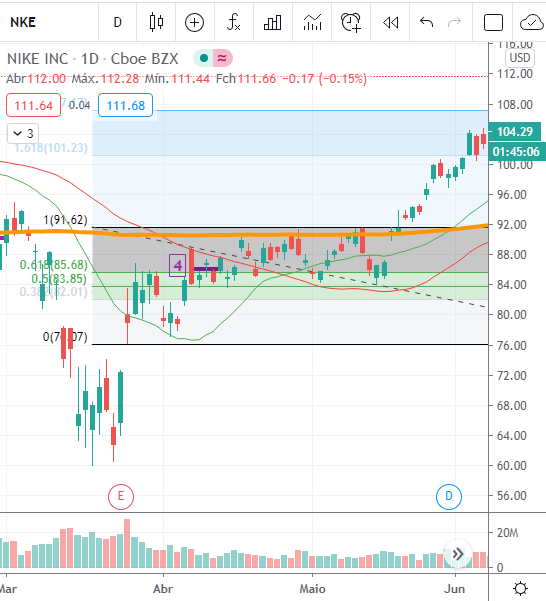
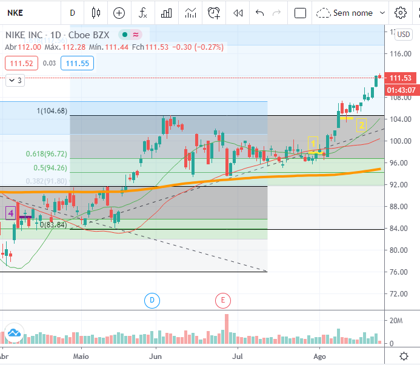

--- 
template: blog-post 
title: "Estudo de Caso: NYSE:NKE" 
slug: EstudoCasoNKE 
date: 2020-08-26T00:00:00.000Z 
description: Lucro sim, mas podemos dizer "um bom resultado"?
featuredImage: ./EstudoNKEimgs/nike.png
--- 

  

  

Lucro sim, mas podemos dizer "um bom resultado"? 
===

## Cenário 

Operação aberta antes da crise provocada pelo impacto do **COVID-19**, primeira entrada foi numa continuação de tendência de alta, seguida por uma segunda entrada (ainda antes da crise) para aumentar o percentual do ativo no portfólio, considerando a força da tendência (**Figura 1**).  

Contudo houve a forte queda no início de Março, onde realizamos uma nova entrada na _MA200_( média móvel de 200 candles) em um _suporte/resistência_. 
Constatada a crise (meados de Março), aguardamos a reação do **S&P500** para realizar novas entradas, concluindo assim uma quarta operação já em Abril.  

Após um longo período, realizamos uma saída parcial para reduzir o percentual do ativo no portfolio e seguir com trailing stop nas posições mantidas, porém acabamos por sair da operação de forma precoce (**Figura 3**). Portanto a resposta à pergunta é: “Analisando a operação com os graficos abaixo, concluímos que o resultado poderia ter sido melhor.” 

 

## Vamos aos fatos. 
 
Por quê saímos da operação de forma precoce com o _trailing stop_? 

Não Respeitamos os nossos *princípios da operação*, que são: 

* Lotes em _**tamanho proporcional**_; 
* _**Distância proporcional**_ entre reentradas; 
* Trailing Stop **_após alvos alcançados_**; 
* Atualizar o trailing Stop **_apenas após a confirmação_** do movimento projetado. 

Após a _“aparente”_ retomada do **S&P500** em início de Maio, a primeira projeção de _Fibonacci_ mostrava o primeiro alvo em _*$101,23*_, onde fechávamos toda a posição ou ajustávamos o trailing stop considerando o alvo atingido (veja: **princípios de operação**).  

Como hesitamos na tomada de decisão a tempo, perdemos a oportunidade de encerrar a operação 2 meses antes. 

Iniciando nova análise, traçamos a projeção de _Fibonacci_ e identificamos novo alvo. Neste momento já consideramos o _**aspecto psicológico**_ desta operação. O tamanho do _**Lote já tem um percentual acima da média de outros ativos**_ do portfólio e a operação aberta por um _**longo período**_ (_ultrapassados 90 dias_). A _**inquietude**_ e _**ansiedade**_ aumentam a _**aversão ao risco**_ e a _**tendência de erro**_ do investidor. Em outras palavras ficamos nos perguntando "...**e se** tivéssemos saído antes? ou **e se** tivéssemos perdido a entrada 1 ou 2?" 

 

Aqui começamos as operações para reduzir o tamanho do ativo na carteira. Após um teste de topo não confirmado sobre as médias(_Figura 3, linha 1_), reduzimos o tamanho do lote anulando as operações _de forma precipitada_. E finalmente; após quase 6 meses; estando positivos na operação, buscamos o alvo traçado pela segunda vez. Confirmando o rompimento do topo anterior, tomamos mais uma decisão precipitada. Encurtamos o trailing Stop (_Figura 3, linha 2_), antes da confirmação do movimento (veja: **princípios de operação**).

 

Passamos a maior parte do tempo expostos ao risco navegando a recuperação prevista do ativo. No momento que o ativo retoma sua tendência de alta o desgaste e a frustração causados pelas decisões precipitadas anteriores influenciaram a consistência e respeito a estratégia. É quando a _**Heurística da Disponibilidade**_ muito útil para tomadas de decisões no nosso cotidiano nos atrapalha, pois cria um viés cognitivo onde a carga emocional influencia em novas análises.  

Fica a lição neste cenário, respeite sua estratégia e análise e fique atento as armadilhas do emocional em seus Investimentos. Espero que o caso acima ajude nas próximas operações. Keep Investing!

Análises por &#128200; [@diogopessoa](https://www.etoro.com/people/diogopessoa) & [@pessoa_bs](https://www.etoro.com/people/pessoa_bs).
